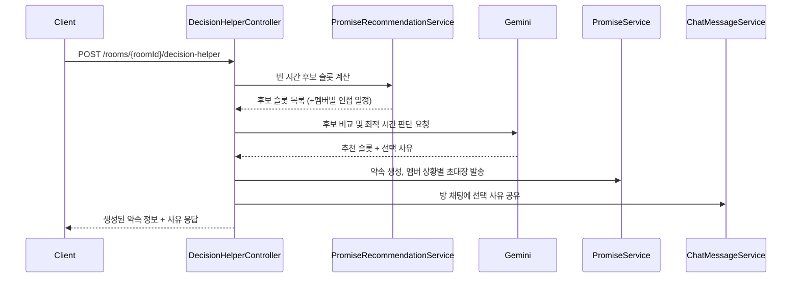

# Tebly Server

친구·모임 멤버들의 개인 일정을 모아 **빈 시간을 자동으로 추천**하고, 고르기 애매할 땐 **LLM("결정이")이 대신 판단해서 약속까지 잡아주는** 일정 조율 앱의 백엔드 서버입니다.


## ✨ 핵심 기능

- **빈 시간 추천 알고리즘** — 방 멤버들의 등록된 일정(반복 일정 포함)을 분석해 전원이 가능한 시간, 또는 충돌이 가장 적은 시간을 추천합니다.
- **결정이 (Decision Helper)** — 추천 후보 중 뭘 고를지 애매할 때, Google Gemini가 멤버들의 인접 일정까지 고려해 최적 시간 하나를 골라주고 **약속 생성 → 상황별 초대장 발송 → 채팅방에 사유 공유**까지 한 번에 처리합니다.
- **OCR 시간표 등록** — 에브리타임 등 시간표 캡처 이미지를 올리면 CLOVA OCR로 텍스트를 추출해 강의/알바 일정을 자동으로 파싱합니다.
- **실시간 채팅** — WebSocket(STOMP) 기반으로 방별 채팅을 지원합니다.
- **소셜 로그인 + 알림** — 구글/카카오 OAuth2 로그인, JWT 인증, 방 초대·약속 초대·콕찌르기 알림을 제공합니다.

## 🛠 기술 스택

| 구분 | 내용 |
|---|---|
| Language / Framework | Java 21, Spring Boot 4.0.6, Spring Security, Spring Data JPA, Spring WebSocket, Bean Validation |
| Database | PostgreSQL 15 (운영), H2 (테스트) |
| 인증 | JWT (jjwt), OAuth2 Client (Google, Kakao) |
| Infra / DevOps | Docker, Docker Compose, GitHub Actions, GitHub Container Registry(GHCR), AWS EC2 |
| External API | Google Gemini API (결정이 LLM), NAVER CLOVA OCR (시간표 인식) |
| API 문서 | springdoc-openapi (Swagger UI) |

## 🏗 아키텍처

도메인 기반 패키지 구조입니다.

```
src/main/java/com/example/teblyserver
├── auth           # 인증/인가 (JWT, OAuth2 로그인)
├── chat           # 실시간 채팅 (WebSocket/STOMP)
├── common         # 공통 응답 포맷(ApiResponse), 예외 처리
├── config         # 전역 설정 (Security, Swagger, WebSocket, 외부 API 연동)
├── decision       # 결정이 — LLM 기반 약속 시간 결정 도우미
├── friend         # 친구 관리
├── notification   # 알림
├── promise        # 약속(모임) 생성/관리, 빈 시간 추천 알고리즘
├── room           # 방(그룹) 관리
└── schedule       # 개인 일정 관리 + OCR 시간표 파싱
```

"결정이" 호출 시 전체 흐름은 다음과 같습니다.



## 🚀 시작하기

### 사전 요구사항

- JDK 21
- Docker & Docker Compose

### 환경변수

레포 루트에 `.env` 파일을 만들고 아래 값을 채워주세요. (실제 키 값은 각자 발급받아야 합니다.)

| 변수명 | 설명 |
|---|---|
| `JWT_SECRET` | JWT 서명(HMAC)에 사용하는 비밀키 |
| `GOOGLE_CLIENT_ID` / `GOOGLE_CLIENT_SECRET` | 구글 OAuth2 로그인 클라이언트 정보 |
| `KAKAO_CLIENT_ID` / `KAKAO_CLIENT_SECRET` | 카카오 OAuth2 로그인 클라이언트 정보 |
| `CLOVA_OCR_API_URL` / `CLOVA_OCR_SECRET_KEY` | 네이버 CLOVA OCR API 접속 정보 |
| `GEMINI_API_KEY` | Google Gemini API 키 (결정이 기능) |

### 로컬 실행

DB만 컨테이너로 띄우고, 앱은 로컬에서 `local` 프로파일로 직접 실행하는 방식을 권장합니다.

```bash
# 1. PostgreSQL 컨테이너만 기동
docker compose up -d db

# 2. 환경변수 로드 후 로컬 프로파일로 앱 실행
set -a && source .env && set +a
./gradlew bootRun --args='--spring.profiles.active=local'
```

서버는 `http://localhost:8080`에서 기동됩니다.

> `docker-compose.yml`의 `app` 서비스는 GHCR에 미리 빌드된 이미지(`ghcr.io/tebly-cbhj/tebly-server:latest`)를 pull해서 실행하는 배포용 구성입니다. 로컬에서 코드를 수정하며 확인하려면 위처럼 `bootRun`으로 직접 띄우세요.

## 📖 API 문서

서버 기동 후 Swagger UI에서 전체 API 스펙을 확인할 수 있습니다.

- Swagger UI: `http://localhost:8080/swagger-ui.html`
- OpenAPI JSON: `http://localhost:8080/v3/api-docs`

<details>
<summary>주요 엔드포인트 목록 (도메인별)</summary>

**인증 / 유저** (`/auth`, `/users`)
| Method | Path | 설명 |
|---|---|---|
| POST | `/auth/token/refresh` | 리프레시 토큰으로 재발급 |
| POST | `/auth/signout` | 로그아웃 |
| DELETE | `/auth/withdraw` | 회원 탈퇴 |
| GET | `/users/me` | 내 프로필 조회 |
| PATCH | `/users/me` | 내 프로필 수정 |
| GET | `/users/me/invite-code` | 초대 코드 조회 |

**방 (Room)** (`/rooms`)
| Method | Path | 설명 |
|---|---|---|
| POST | `/rooms` | 방 생성 및 멤버 초대 |
| GET | `/rooms` | 내가 참여 중인 방 목록 조회 |
| GET | `/rooms/{roomId}` | 방 상세 조회 |
| PATCH | `/rooms/{roomId}` | 방 정보 수정 |
| DELETE | `/rooms/{roomId}` | 방 삭제 |
| GET | `/rooms/{roomId}/members` | 방 멤버 목록 조회 |
| POST | `/rooms/{roomId}/members` | 멤버 초대 |
| DELETE | `/rooms/{roomId}/members` | 멤버 강퇴 |
| DELETE | `/rooms/{roomId}/members/me` | 방 나가기 |
| PATCH | `/rooms/{roomId}/members/me/respond` | 방 초대 수락/거절 |

**약속 (Promise)** (`/rooms/{roomId}/promises`, `/promises`)
| Method | Path | 설명 |
|---|---|---|
| POST | `/rooms/{roomId}/promise-time-recommendations` | 빈 시간 추천 |
| POST | `/rooms/{roomId}/promises/from-recommendation` | 추천 시간 선택 기반 약속 생성 |
| GET | `/promises/{promiseId}` | 약속 상세 조회 |
| PATCH | `/promises/{promiseId}` | 약속 수정 |
| PATCH | `/promises/{promiseId}/confirm` | 약속 확정 |
| PATCH | `/promises/{promiseId}/invitations/me` | 약속 초대장 수락/거절 |
| DELETE | `/promises/{promiseId}` | 약속 삭제 |
| POST | `/promises/{promiseId}/poke` | 미응답 멤버 콕찌르기 |
| POST | `/promises/{promiseId}/time-recommendations` | 약속 수정용 빈 시간 재추천 |
| PATCH | `/promises/{promiseId}/time/from-recommendation` | 추천 시간 기반 약속 시간 수정 |

**결정이 (Decision Helper)** (`/api/v1/rooms`)
| Method | Path | 설명 |
|---|---|---|
| POST | `/api/v1/rooms/{roomId}/decision-helper` | 후보 중 최적 시간을 LLM이 골라 약속 자동 생성 |

**일정 / OCR** (`/schedules`)
| Method | Path | 설명 |
|---|---|---|
| GET | `/schedules` | 내 일정 전체 조회 |
| POST | `/schedules/events` | 일정 직접 추가 |
| PATCH | `/schedules/events/{scheduleId}` | 일정 수정 |
| DELETE | `/schedules/events/{scheduleId}` | 일정 삭제 |
| GET | `/schedules/categories` | 카테고리 목록 조회 |
| POST | `/schedules/categories` | 카테고리 추가 |
| PATCH | `/schedules/categories/{category_id}` | 카테고리 수정 |
| DELETE | `/schedules/categories/{category_id}` | 카테고리 삭제 |
| POST | `/schedules/ocr` | 이미지에서 일정 추출 (CLOVA OCR) |
| POST | `/schedules/ocr/confirm` | OCR 추출 일정 확정 저장 |

**채팅 / 알림 / 친구**
| Method | Path | 설명 |
|---|---|---|
| `MESSAGE` | `/chat/send` (STOMP) | 채팅 메시지 전송 |
| GET | `/chat/rooms/{roomId}/messages` | 채팅 메시지 이력 조회 |
| GET | `/notifications/invitation` | 초대 알림 목록 조회 |
| GET | `/notifications/common` | 일반 알림 목록 조회 |
| PATCH | `/notifications/common/{id}/read` | 알림 읽음 처리 |
| GET | `/friends` | 친구 목록 조회 |
| POST | `/friends/requests/code` | 초대 코드로 친구 추가 |
| POST | `/friends/requests/link` | 링크로 친구 추가 |
| DELETE | `/friends/{friendId}` | 친구 삭제 |
| GET | `/friends/{friendId}/schedules` | 친구 일정 조회 |

</details>

## 🔀 브랜치 전략 & 커밋 컨벤션

- **브랜치**: `main`(배포) / `develop`(통합, push 시 EC2 자동 배포) / `feat/#이슈번호-설명`, `fix/설명` 형태의 기능 브랜치
- **커밋 메시지**: Conventional Commits 스타일 (`feat:`, `fix:`, `style:` 등)을 따르며, PR/이슈 템플릿(`.github/`)을 통해 협업합니다.

## 👥 팀

[tebly-cbhj 조직의 컨트리뷰터 목록 보기](https://github.com/tebly-cbhj/tebly-server/graphs/contributors)
